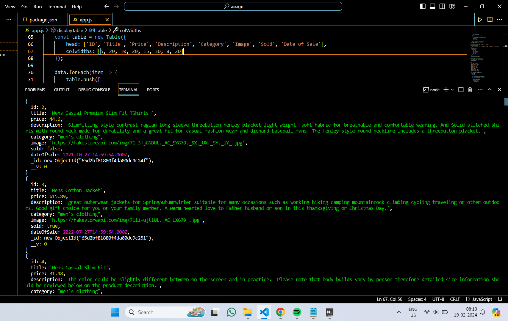
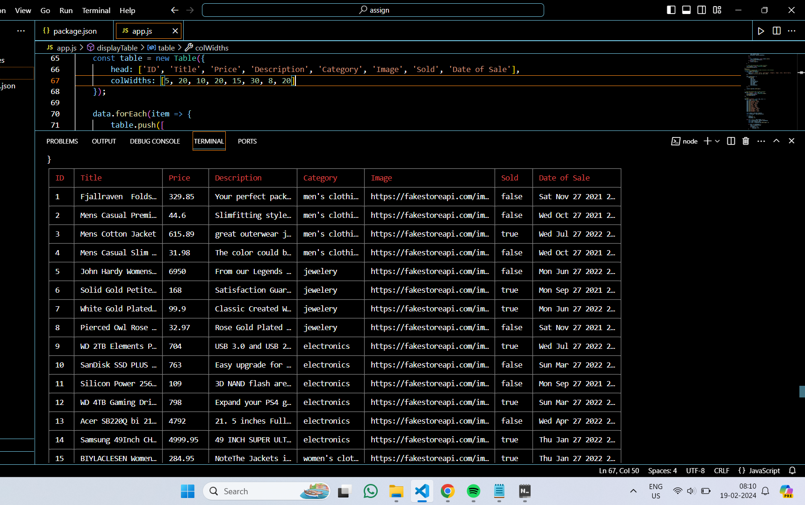

# Roxiler Systems Backend Task

## Installation Process

1. **Clone the Repository:**
    ```bash
    git clone https://github.com/KhushiramMeena/Roxiler-System-Assignment.git
    ```

2. **Navigate to the Project Directory:**
    ```bash
    cd Roxiler-System-Assignment
    ```

3. **Install Dependencies:**
    ```bash
    npm install
    ```

4. **Start the Server:**
    ```bash
    nodemon app.js
    ```

5. **View Fetched Data:**
    - Open your terminal and observe the fetched data displayed in the form of a table.

## Screenshots
**JSON format**


**Table format**

## Note
Ensure that you have [Node.js](https://nodejs.org/) and [Git](https://git-scm.com/) installed on your system before proceeding with the installation.

Feel free to explore the code and customize it as needed.
